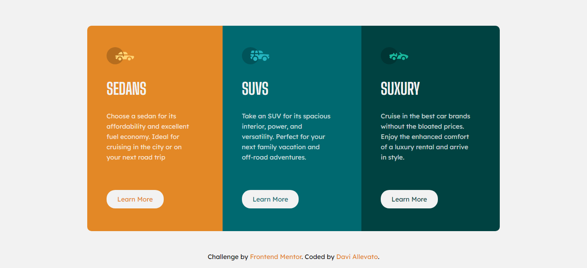

# Frontend Mentor - 3-column preview card component solution

Esta é uma solução para o [3-column preview card component challenge on Frontend Mentor](https://www.frontendmentor.io/challenges/3column-preview-card-component-pH92eAR2-). Os desafios do Frontend Mentor ajudam você a melhorar suas habilidades de codificação criando projetos realistas.

## Tabela de conteúdos

- [Visão geral](#Visão-geral)
  - [O Desafio](#O-Desafio)
  - [Screenshot](#screenshot)
  - [Links](#links)
- [Meu processo](#Meu-processo)
  - [Construído com](#Construído-com)
  - [Desenvolvimento contínuo](#Desenvolvimento-contínuo)
  - [Recursos úteis](#Recursos-úteis)
- [Autor](#autor)

## Visão geral

### O Desafio

Os usuários devem ser capazes de:

- Visualize o layout ideal dependendo do tamanho da tela do dispositivo
- Veja os estados de foco para elementos interativos

### Screenshot

 ***Desktop design***

 ***Mobile design***

### Links

- URL do site ao vivo: [https://daviallevato.github.io/FM-3column-preview-card/](https://daviallevato.github.io/FM-3column-preview-card/)

## Meu processo

### Construído com

- Marcação HTML5 semântica
- Propriedades personalizadas de CSS
- Flexbox

### Recursos úteis

- [Flexbox](https://www.devmedia.com.br/css3-flexbox-funcionamento-e-propriedades/29532) - Este é um artigo incrível que me ajudou a entender flexbox. Eu recomendo para quem ainda está aprendendo este conceito.

## Autor

- Frontend Mentor - [@DaviAllevato](https://www.frontendmentor.io/profile/DaviAllevato)

- GitHub - [DaviAllevato](https://github.com/DaviAllevato)

